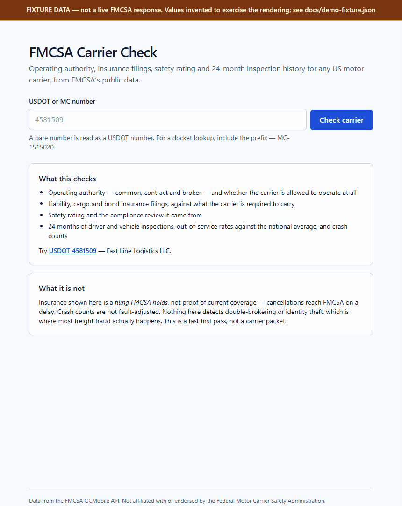

# FMCSA Carrier Check

[](https://github.com/yurii1exe/fmcsa-carrier-check/actions/workflows/ci.yml)
[](LICENSE)

Enter a USDOT or MC number, get the carrier's operating authority, insurance
filings, safety rating and 24-month inspection and crash history — from FMCSA's
public data, on one page.



> **The carrier data in that recording is a fixture, not a live FMCSA
> response.** No webKey was used to make it. The app was pointed at a local stub
> serving [`docs/demo-fixture.json`](docs/demo-fixture.json) — a synthetic record
> built to the documented QCMobile field names. The subject is my own carrier,
> FAST LINE LOGISTICS LLC / USDOT 4581509, so that no third party is shown with
> invented compliance data; every figure against it — inspections,
> out-of-service rates, insurance filings — is made up to exercise the
> rendering and is not a fact about that carrier or any other. Everything else
> in the frame is real: the same identifier parsing, the same risk rules, the
> same components, the same streaming.
>
> Three things in it are worth watching, because they are the judgement calls
> rather than the layout:
>
> - A carrier name is rejected as invalid input **before a request is made** —
>   name search is a different endpoint and is not supported yet, so the door is
>   labelled rather than left ajar.
> - The missing safety rating is filed as a **Note**, not a warning. Unrated is
>   the normal state for a carrier that has never had an on-site review.
> - Both out-of-service rates in the fixture sit above the national average, and
>   **only the vehicle one raises a flag**. The driver rate — 33.3% on three
>   inspections — is suppressed under the five-inspection floor. Every check
>   prints the API fields it read underneath itself.

Brokers and 3PLs vet carriers before every load. The commercial tools that do
this — Highway, RMIS, Carrier411 — are subscriptions. The underlying data is
free and public; what you pay for is the packaging. This is the packaging.

```
Next.js 15 (App Router) · TypeScript · Tailwind 4 · FMCSA QCMobile API
```

Example lookup: `/?q=4581509` — FAST LINE LOGISTICS LLC.

---

## Why this is not just a table dump

Three things about FMCSA data reliably trip up people reading it for the first
time, and the interface is built around them.

**"No safety rating" is the normal state, not a red flag.** A rating is only
assigned after an on-site compliance review, and most carriers have never had
one. Read SAFER without knowing that and you reject a perfectly good carrier for
having a blank field. The tool says so explicitly, and files it as a note rather
than a warning.

**"Insurance on file" is a filing, not a certificate.** FMCSA holds a record
that an insurer filed a form. Cancellations reach FMCSA on a delay, so a filing
can outlive the policy behind it. The insurance card says this on it, every
time, because the difference is the entire liability.

**A 50% out-of-service rate on two inspections means nothing.** Rate comparisons
against the national average are suppressed below five inspections. A tool that
flags statistical noise trains you to ignore its flags.

Every check names the API fields it read — `bipdInsuranceRequired,
bipdInsuranceOnFile` — underneath the finding. There is no score and no
weighting. A risk number whose derivation is hidden is worth nothing to someone
deciding whether to hand over a $40,000 load.

---

## The data source, and why

**FMCSA QCMobile API** — `https://mobile.fmcsa.dot.gov/qc/services`. Official,
free, JSON, and a single `/carriers/{dot}` call returns everything this tool
needs: authority status, insurance filings, safety rating, crash counts,
inspection counts and out-of-service rates. It needs a free webKey.

Rejected:

| Source | Why not |
|---|---|
| **SAFER Company Snapshot** | The page brokers actually use, but there is no API behind it — it is an HTML form. Every library that offers it is scraping. Fine until DOT changes a table cell. |
| **data.transportation.gov (Socrata)** | Real API, bulk downloads, but it publishes periodic snapshot extracts. Good for analysis across the whole carrier population, wrong for "is this carrier authorised right now". |
| **Commercial aggregators** | Paid, and rebuilding a paid product on top of the same paid product proves nothing. |

QCMobile wins on all three counts that matter: it is first-party, it is
per-carrier and current, and it is documented well enough to type against.

### The one trap worth knowing

A request with a bad webKey does not return 401. It returns **HTTP 404** with:

```json
{ "content": "Webkey not found", "retrievalDate": "...", "_links": { ... } }
```

That is the same status code as a USDOT number nobody owns. Take the status at
face value and every user of a misconfigured deployment is told the carrier does
not exist, and goes hunting for a typo that is not there. So the body is
inspected on 404, and `content` is typed as `unknown` rather than as the success
shape — because on that path it is a string where the object should be.

Verified against the live API on 2026-08-15. There is a test that pins the
behaviour, using that response body verbatim.

---

## Running it

```bash
git clone https://github.com/yurii1exe/fmcsa-carrier-check
cd fmcsa-carrier-check
npm install
cp .env.example .env.local     # then add your webKey
npm run dev
```

Get a webKey free: [FMCSA developer portal](https://mobile.fmcsa.dot.gov/QCDevsite/docs/getStarted)
→ sign in with Login.gov → **My WebKeys** → **Get a new WebKey**. No FMCSA
registration, no cost, a couple of minutes.

Without a key the app still runs and tells you exactly what is missing and how
to fix it, rather than crashing or showing an empty page.

```bash
npm test          # 114 tests
npm run typecheck
npm run lint
npm run build
```

To put it on the internet, see **[DEPLOY.md](DEPLOY.md)** — getting the key,
setting it in Vercel, and the four URLs to check afterwards.

---

## How it is built

**The key never reaches the browser.** All fetching happens in server
components. `src/lib/fmcsa/config.ts` and `client.ts` both start with `import
"server-only"`, so importing either from a client component is a build error
rather than a leak, and the variable is deliberately not named
`NEXT_PUBLIC_FMCSA_WEB_KEY` — that prefix is exactly what makes Next inline a
value into the client bundle.

QCMobile takes its credential as a **query parameter**, which means the key is
inside every request URL, which means any code path that logs or echoes a URL
leaks it. Rather than remembering not to do that, every string that could
contain one goes through `redactWebKey()` before it becomes an error message.
There is a test that fails if a wrapped network error carries the key through.

**Search state lives in the URL.** `/?q=4581509` is the whole application state,
so results are shareable and bookmarkable, the back button works, and the search
form is a plain GET form that works before hydration — worth having for a tool
someone opens on a phone in a yard on one bar of signal.

**Responses are cached for an hour** (`next: { revalidate: 3600 }`). Census
snapshots are monthly; inspection and crash counts move over days. Re-fetching
per request would add latency and spend quota to learn nothing.

**Requests are rate limited per client**, 20 a minute, because the webKey
belongs to whoever deployed the site and the search box is open to the internet.
It is an in-memory fixed window: per serverless instance, not global, and it
resets on cold start. A speed bump, not a security control — `rate-limit.ts`
says so where it is implemented.

**Errors are nine distinct states**, not one. Invalid input, carrier not found,
key missing, key rejected, rate limited, FMCSA 5xx, timeout, FMCSA unreachable,
unreadable response. They differ because the reader's next move differs: check
the number, wait a minute, or tell whoever deployed this. Collapsing them into
"something went wrong" throws away the only useful part. A retry button appears
only on the four where retrying could plausibly work.

**Nothing is typed `any`.** API responses come in as `unknown` and are narrowed
by hand in `src/lib/fmcsa/parse.ts`, which tolerates the shapes the API actually
uses — counts as numeric strings, rates with a trailing `%`, most fields null,
and the docket endpoint returning an array where the DOT endpoint returns an
object.

### Layout

```
src/lib/fmcsa/
  identifier.ts   what the user typed -> DOT or docket lookup
  client.ts       the only module that talks to FMCSA
  parse.ts        unknown -> typed, defensively
  risk.ts         carrier record -> flags, each naming its source fields
  types.ts        the API's field names, unrenamed
  errors.ts       the error taxonomy + webKey redaction
src/components/   report, error panels, search form, skeleton
src/app/page.tsx  one route; slow work sits below a Suspense boundary
```

### Tests

105 across seven files, concentrated where a change at FMCSA would break things
silently: response parsing, the error mapping in the client, and the risk rules.
`client.test.ts` mocks `fetch` and asserts on the full HTTP matrix — 200 with a
carrier, 200 with null content, 404 for a real miss, 404 for a bad webKey, 401,
403, 429, 5xx, an HTML error page, a timeout and a connection failure.

Fixtures are synthetic and labelled as such; the carriers in them are invented.
The single exception is the `Webkey not found` body, which is a real response
copied verbatim, because its exact shape is the point.

---

## Accessibility and mobile

Single column below 640px, and nothing in the layout has a fixed width. Every
status is a text label as well as a colour, so severity survives greyscale,
colour blindness and a screenshot.
Label/value pairs are `<dl>` markup. The loading state is a `role="status"`
region with a text announcement rather than a set of empty boxes. Skip link,
visible focus rings, and a search form that submits without JavaScript.

---

## Status and limits

This is a reference tool. It reads authority, filings and history — it does not
detect double-brokering or carrier identity theft, which is where most freight
fraud actually happens. It is a fast first pass, not a carrier packet, and not a
replacement for a certificate of insurance from the agent.

Data is FMCSA's, and so are its lags and its errors.

**The success path has not yet been run against the live API.** It is built and
tested against the documented response shapes, and the demo above is recorded
against those same fixtures. Running it needs a webKey, which is the one thing
this repository cannot contain.

What *has* been confirmed against the real service, re-checked 2026-08-16 by
running the built app against `mobile.fmcsa.dot.gov` with a deliberately
invalid key:

- Both endpoints the app builds — `/carriers/{dot}` and
  `/carriers/docket-number/{n}` — exist and answer, and both are still listed
  on the [QCMobile API page](https://mobile.fmcsa.dot.gov/QCDevsite/docs/qcApi).
- Credential failures arrive as HTTP 404 with a string body, in two different
  wordings: `Webkey not found` for a bad key and `Must provide Webkey` for no
  key. Both are reproduced verbatim in the fixtures and both are asserted to
  produce "FMCSA rejected the API key" rather than "no carrier found".
- End to end, that path renders the right error panel for both a USDOT and an
  MC lookup, and the key appears nowhere in the returned HTML.

**One discrepancy worth knowing about before trusting a live result.** FMCSA's
own [API elements page](https://mobile.fmcsa.dot.gov/QCDevsite/docs/apiElements)
documents a much smaller field set than `/carriers/{dot}` actually returns, and
two of the names it does list disagree with what this code reads —
`allowToOperate` and `phyZip` there, against `allowedToOperate` and
`phyZipcode` here. The code's spelling matches independent third-party clients
of the same API, so the documentation page appears to be stale rather than the
code wrong; but this is unresolved until the success path runs against a real
key. If a live report comes back with a blank operating status or a missing
ZIP, that page is the first place to look.

Not affiliated with or endorsed by the Federal Motor Carrier Safety
Administration.

## License

MIT — see [LICENSE](LICENSE).
